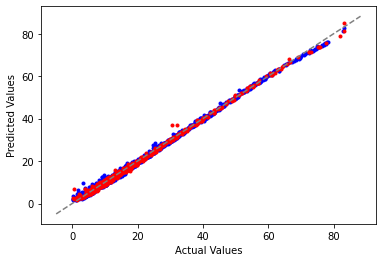

Delayed Drug Release App
  

## by Josh Bartels [@linkedin](https://www.linkedin.com/in/joshua-bartels-756309138/)

# Overview / Goals

- [X] Simulate and visualize drug release mediated through polymer dissolution. 
-	[X] Explore the nonlinear relationship between film design and active drug concentration. 
-	[X] Identify “just right” designs where active concentration is never too high for safety nor too low for effectiveness.
-	[X] Build machine learning architecture trained on simulated data to predict key membrane performance metrics
 
# Part 1 : Modelling the System

  

**Problem**: In a delayed release system, there are competing effects governing the active drug concentration preventing it from being predicted simply.

**Goal**: Design a polymer coating that safely releases an active small molecule (drug) over a desired range of time. 
- Polymer film thickness decreases linearly with time: it dissolves at the same rate regardless of starting thickness.
- The length of the polymer chain (its molecular weight) has a non-linear effect on rate of polymer dissolution.  Longer polymer chains become more entangled, resulting in delayed dissolution. A great resource on this by Bae Soo Kong, Yong Sung Kwon, and Dukjoon Kim can be found at (Polymer Journal, Vol. 29, No. 9, pp 722-732 (1997); https://www.nature.com/articles/pj1997129.pdf).  I borrow a simplified dissolution rate vs molecular weight relationship and will whole-heartedly ignore temperature effects for simplicity:
  

     
  

    Where Rd is the rate of dissolution, k is a rate constant we set to an arbitrary yet reasonable value, and Mw is the polymer molecular weight. The drug is not infinitely stable and either becomes inactive or eliminated from the body so that the active concentration will decay with a half-life:
  

     
  

    Where C is the current concentration, C0 is the initial concentration, dt is the time passed, and t1/2 is the half-life.  Notice that a higher drug concentrations will result in a sharper decay in active concentration. There are two competing effects, linear drug introduction and non-linear deactivation/removal.  Since the drug is continually introduced through film dissolution, there is no constant rate of decay and we must continually recalculate the decay rate with the current concentration.
- Initial plots of active drug concentration for three different molecular weights and constant thickness:

    With the inclusion of drug lifetime there is a dramatic difference in the safety and effectiveness of these three film designs.  The lowest molecular weight film (blue) delivers the drug too quickly and crosses our safety threshold, while the highest molecular weight (green) sits dangerously close to the minimum effective dose (MED).  Although close to the MED, we observe a desirable feature of an extended plateau in the case of the highest molecular weight modelled. 
&nbsp;

# Part 2 : Interactive Dashboard [@render](https://delayed-drug-release-app.onrender.com)

- Interactive data visualization using Plotly Dash
- Try making a membrane that is "just right"  
&nbsp;

# Part 3 : Machine Learning

 
 
- Simulate a database of membrane performance (if it is safe, time to activate, and duration of drug activity) 
- Build and train a Neural Network on the database
- Visualize model quality
