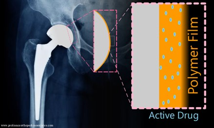
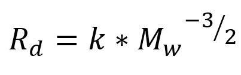
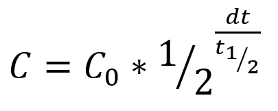
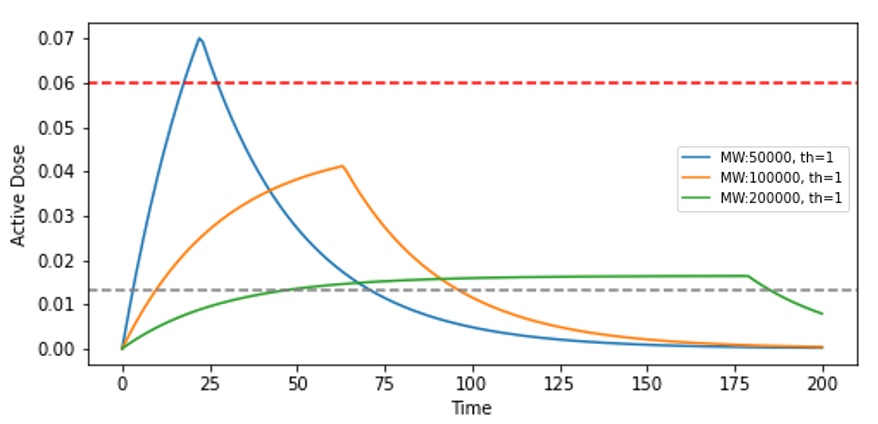
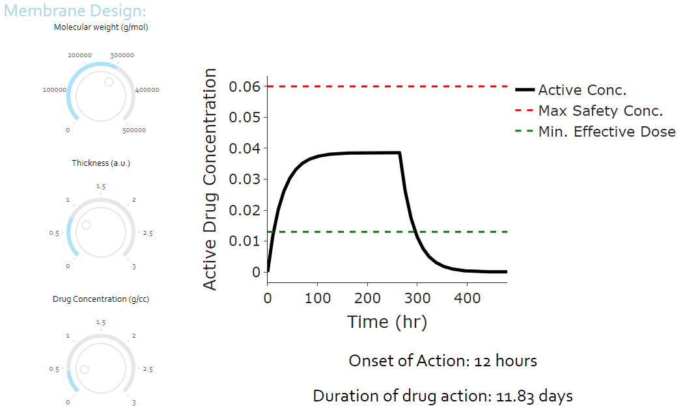
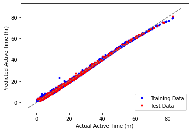
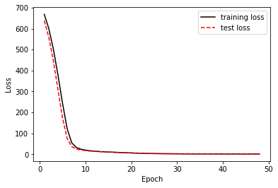
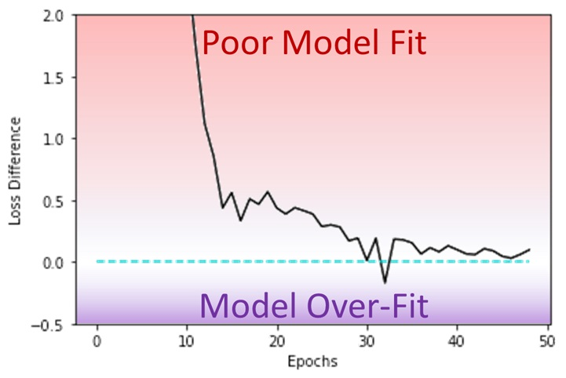

<span style="color:white">
Delayed Drug Release App
</span>  

Developed using Pandas, Numpy, Dash, TensorFlow, and scikit-learn libraries  
## by Josh Bartels [@Linkedin](https://www.linkedin.com/in/joshua-bartels-756309138/)

# Overview / Goals
- Simulate and visualize drug release mediated through polymer dissolution. 
-	Explore the nonlinear relationship between film design and active drug concentration. 
-	Identify “just right” designs where active concentration is never too high for safety nor too low for effectiveness.
-	Build machine learning architecture trained on simulated data to predict key membrane performance metrics
 
# Part 1 : Modelling the System
  <p align="center">
   
  </p>

### **Problem:**  
> In a delayed release system, there are competing effects governing the active drug concentration preventing it from being predicted simply.

### **Goal:**  
> Design a polymer coating that safely releases an active small molecule (drug) over a desired range of time.  

### **Effects to include:**  
- During dissolution, polymer film thickness decreases linearly with time
- Increasing molecular weight gives a nonlinear delay to dissolution time
- The half-life equation describes a drug's elimination rate, and depends on the active concentration
  
### **Description**
   The length of the polymer chain (its molecular weight) has a non-linear effect on rate of polymer dissolution.  Longer polymer chains become more entangled, resulting in delayed dissolution. A great resource on this by Bae Soo Kong, Yong Sung Kwon, and Dukjoon Kim can be found at (Polymer Journal, Vol. 29, No. 9, pp 722-732 (1997); https://www.nature.com/articles/pj1997129.pdf).  I borrow a simplified dissolution rate vs molecular weight relationship and omit temperature effects for simplicity:
  <p align="center">
     
  </p>
 Where Rd is the rate of dissolution, k is a rate constant we set to an arbitrary yet reasonable value, and Mw is the polymer molecular weight. The drug is not infinitely stable and either becomes inactive or eliminated from the body so that the active concentration will decay with a half-life:  
  <p align="center">
     
  </p>
 Where C is the current concentration, C0 is the initial concentration, dt is the time passed, and t1/2 is the half-life.  Notice that a higher drug concentrations will result in a sharper decay in active concentration. There are two competing effects, linear drug introduction and non-linear deactivation/removal.  Since the drug is continually introduced through film dissolution, there is no constant rate of decay and we must continually recalculate the decay rate with the current concentration.  
    
### **Initial plots:**  
Active drug concentration vs. time for three different molecular weights and a constant thickness
 <p align="center">
  
 </p>
 
   With the inclusion of drug lifetime there is a dramatic difference in the safety and effectiveness.  The lowest molecular weight film (blue) delivers the drug too quickly and crosses our safety threshold, while the highest molecular weight (green) sits dangerously close to the minimum effective dose (MED).  Although close to the MED, we observe a desirable feature of an extended plateau in the case of the highest molecular weight modelled. <p>&nbsp;</p>  

# Part 2 : Interactive Dashboard [@render](https://delayed-drug-release-app.onrender.com) [@github](https://github.com/JMBartels/Delayed-Drug-Release/blob/main/Delayed-Drug-Release-App.py)

 <!--<p align="center">
  
  <object data="filename.html" width="1600" height="4800"></object>
 </p>  -->
 <object data="filename.html"></object>
 
- The next goal is to design a membrane that has a plateau between MED and MSC and a duration around 15 days.
- Lets build an interactive simulation dashboard in Python with Plotly/Dash to explore designs intuitively with knobs that dynamically set our design variables.
- Follow the link to run the interactive web-deployed app on Render or use the github repo to run it on your machine.

<span style="color:red"> NOTE: the Render server is slow and will take a minute or two to load and 10-15 seconds to recalculate after you turn a knob, please be patient! </span> 
  <p>&nbsp;</p>


# Part 3 : Machine Learning [@github](https://github.com/JMBartels/Delayed-Drug-Release/blob/main/SimFilmNeuralNetwork.py)

<p align="center">
 
</p> 

- This system offers a complex relationship between the three input variables (MW, thickness, drug concentration) and the three performance metrics (is it safe, time to activate, active drug duration), and offers a rich platform for machine learning to model
- Simulate a database of membrane performance for 1,000 random possible designs
- Build a Neural Network with Tensorflow and scikit-learn trained on the simulated database
- Visualize the ability of the model to predict active drug duration  

Below is the function that takes the simulated database and builds/fits a neural network to predict active drug time from membrane design
```python 
def make_network(features,targets):
    np.random.seed(42)
    n_epochs = 64
    scaler = preprocessing.StandardScaler()
    corrected_features_array = scaler.fit_transform(corrected_features_array)

    features_train, features_test, target_train, target_test = train_test_split(corrected_features_array,
                                                                               target_array,
                                                                               test_size=0.25,
                                                                               random_state=22)
    network = tf.keras.Sequential()
    network.add(tf.keras.Input(shape=features_train.shape[1],))
    network.add(tf.keras.layers.Dense(units=32,
                            activation="relu",
                            kernel_regularizer=tf.keras.regularizers.l2(0.01)))

    network.add(tf.keras.layers.Dense(units=16, activation="relu", kernel_regularizer=tf.keras.regularizers.l2(0.01),))

    network.add(tf.keras.layers.Dense(units=1))

    network.compile(loss="mse",optimizer="RMSprop",metrics=["mse"])

    history = network.fit(features_train, target_train,epochs=n_epochs,verbose=0,
                         batch_size=100,
                         validation_data=(features_test, target_test))

    training_loss = history.history["loss"]
    test_loss = history.history["val_loss"]
```

<p align="center">
 
</p> 

- The model starts with very poor accuracy but improves significantly after 10 iterations (epochs) through the data
- This plot, at first glance, indicates sufficient fitting at 10 epochs, however the initial fits have such high loss that we cannot tell the fit quality beyond 10 epochs
- Lets look at the difference between the training loss and test loss to see if and when we get to high quality fits

 <p align="center">
 
</p> 

- Here we can see the model reaches our desired quality around 30 epochs and does not extend into the over-fitting regime 

# Wrap-up:
Overall, we were able to take basic chemistry principles and develop a model in python to explore drug release mediated by drug design.  We have an interactive dashboard available on the web that allows the user to key into their desired performance through intuitive exploration. Finally, we simulated a large number of membrane designs and trained a neural network to predict the performance metrics from membrane design. 

<p>&nbsp;</p>
<span style="color:gray;font-size=8px">
This project was conceived and coded solely by me (Josh Bartels), I hope you enjoyed it!
</span>  

