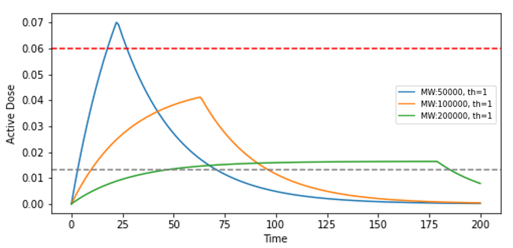
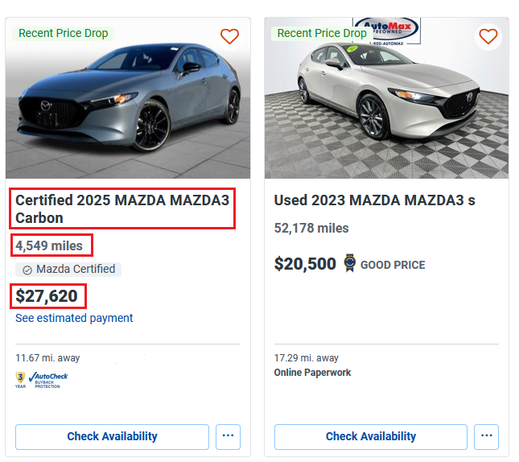
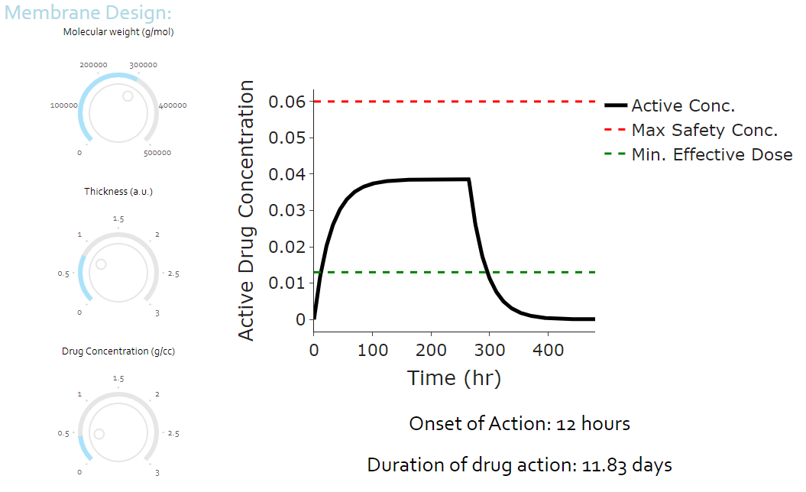
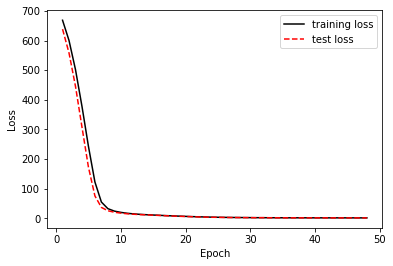

<span style="color:white">
The Cost of a Mile - Trends in Car Devaluation
</span>  

Developed using Pandas, Numpy, Selenium, and Plotly libraries
 No AI tools were used in the development and coding of this project
## by Josh Bartels [@Linkedin](https://www.linkedin.com/in/joshua-bartels-756309138/)

# Overview / Goals
- Extract: Build an API to extract real world car prices and mileage
- Transform: Clean the data to be ready for batch plotting and analysis
- Load: Store data in a central location that can easily be updated
- Analyze: Model the data to answer our guiding questions 

### **Questions:**  
> - How much should I spend to fix my old car?
> - How many miles should I expect to get per $ spent fixing my car?
> - When should I sell my car?
> - What cars retain their value best?

### **Situation:**  
This is how I see my car, shiny brand new with fine engineering and design:

 <p align="center">
  
 </p>

However, this is how everyone else sees my car, from 2010 with +200,000 miles and maybe a few dents:

 <p align="center">
  
 </p>

I drove every mile on this car and love it. I want to keep it as long as I can without making multiple particularly poor economic decisions.
This raises a real problem, I don't know how much it is *worth* to repair. The first thought is to compare the market price of the car to the cost of a fix, but this suggests it is rarely ever worth fixing.
The car still *has* to have value since it gets me from place to place (the role of a car). Instead of defining the value by the price of the car, lets define it as the number of miles.
So then our question becomes: How much is a mile worth on a Mazda3?
 
### **Approach**
> Build and API to search and retrieve data from Autotrader
    
# **Extracting Data:**  
To make an informed decision I need real data to compare costs. We will scrape information from Autotrader in the Boston area using Selenium in Python to control Chrome:

 <p align="center">
  
 </p>
 
   There are a few key parts of this code: 
   1. Understanding the syntax for an Autotrader URL --> how to execute a search
   1. Get the page to load in all the data using page navigation (get around "infinite scrolling")
   1. Get component information from each listing (Price, Miles, Listing Name)

```python
import pandas as pd
from selenium import webdriver
from selenium.webdriver.common.keys import Keys
from selenium.webdriver.chrome.options import Options
from selenium.webdriver.common.by import By

criteria = {
    "postcode": "LS1 2AD",
    "radius": "50",
    "year_from": "2010",
    "year_to": "2014",
    "price_from": "3000",
    "price_to": "20000",
}

cars = [{"make": "Mazda","model": "Mazda3"}]
    
url = "https://www.autotrader.com/cars-for-sale/all-cars/" + \
    f"{car['make']}/" + \
    f"{car['model']}?" + \
    f"searchRadius={criteria['radius']}&" + \
    f"startYear={criteria['year_from']}&" + \
    f"endYear={criteria['year_to']}&" + \
    f"numRecords=100&" +\
    f"zip={criteria['postcode']}"


driver.get(url)

print(f"Searching for {car['make']} {car['model']}...")

time.sleep(5) 

source = driver.page_source
content = BeautifulSoup(source, "html.parser")
    
    
## Scroll down a fraction of the web page to let the autoscroll info load in with 5s loading times##
driver.execute_script("window.scrollTo(0, document.body.scrollHeight*0.2);")
time.sleep(5)
driver.execute_script("window.scrollTo(0, document.body.scrollHeight*0.4);")
time.sleep(5)
driver.execute_script("window.scrollTo(0, document.body.scrollHeight*0.6);")
time.sleep(5)
driver.execute_script("window.scrollTo(0, document.body.scrollHeight*0.8);")
time.sleep(5)
driver.execute_script("window.scrollTo(0, document.body.scrollHeight*0.95);")
time.sleep(5)
    
## With the web page now loaded, find each element, identified by inspecting the webpage html
prices = driver.find_elements(By.XPATH, '//div[@data-cmp="firstPrice"]')
miles = driver.find_elements(By.XPATH, '//div[@data-cmp="mileageSpecification"]')
fullname = driver.find_elements(By.XPATH, '//h2[@aria-level="3"]')

## Extract the text of each element into a list
price_list = []
for p in range(len(prices)):
    price_list.append(prices[p].text)

miles_list = []
for m in range(len(miles)):
    miles_list.append(miles[m].text)
    
fullname_list = []
for n in range(len(fullname)):
    fullname_list.append(fullname[n].text)
```

   <p>&nbsp;</p>  

 <p align="center">
  <embed type="text/html" src="RawCarsData.html" width="800" height="700">
 </p>

# **Transform/Clean Data:**
 
- The next goal is to design a membrane that has a plateau between MED and MSC and a duration around 15 days.
- Lets build an interactive simulation dashboard in Python with Plotly/Dash to explore designs intuitively with knobs that dynamically set our design variables.

 <p align="center">
  <!--<object data="filename.html" width="1600" height="3200"></object> -->
  <embed type="text/html" src="Milestogo.html" width="800" height="700">
 </p>
  
- Follow the link to run the interactive web-deployed app on Render or use the github repo to run it on your machine.
[Link to Full Dash App Deployed on Render](https://delayed-drug-release-app.onrender.com){:target="_blank"}

 <p align="center">
  
 </p>

<span style="color:red"> NOTE: the Render server is slow and will take a minute or two to load and 10-15 seconds to recalculate after you turn a knob, please be patient! </span> 
  <p>&nbsp;</p>


# Part 3 : Machine Learning [@github](https://github.com/JMBartels/Delayed-Drug-Release/blob/main/SimFilmNeuralNetwork.py)

- This system offers a complex relationship between the three input variables (MW, thickness, drug concentration) and the three performance metrics (is it safe, time to activate, active drug duration), and offers a rich platform for machine learning to model
- Simulate a database of membrane performance for 1,000 random possible designs
- Build a Neural Network with Tensorflow and scikit-learn trained on the simulated database
- Visualize the ability of the model to predict active drug duration  

Below is the function that takes the simulated database and builds/fits a neural network to predict active drug time from membrane design
```python 
def make_network(features,targets):
    np.random.seed(42)
    n_epochs = 64
    scaler = preprocessing.StandardScaler()
    corrected_features_array = scaler.fit_transform(corrected_features_array)

    features_train, features_test, target_train, target_test = train_test_split(corrected_features_array,
                                                                               target_array,
                                                                               test_size=0.25,
                                                                               random_state=22)
    network = tf.keras.Sequential()
    network.add(tf.keras.Input(shape=features_train.shape[1],))
    network.add(tf.keras.layers.Dense(units=32,
                            activation="relu",
                            kernel_regularizer=tf.keras.regularizers.l2(0.01)))

    network.add(tf.keras.layers.Dense(units=16, activation="relu", kernel_regularizer=tf.keras.regularizers.l2(0.01),))

    network.add(tf.keras.layers.Dense(units=1))

    network.compile(loss="mse",optimizer="RMSprop",metrics=["mse"])

    history = network.fit(features_train, target_train,epochs=n_epochs,verbose=0,
                         batch_size=100,
                         validation_data=(features_test, target_test))

    training_loss = history.history["loss"]
    test_loss = history.history["val_loss"]
```

<p align="center">
 
</p> 

- Point 1
- Point two
- Point thr33

# Wrap-up:
We obtained a real-world answer to our question: if I spend $2700 fixing my car I should get 21,000 miles before my next major fix, otherwise it is cheaper to be driving a different car.

<p>&nbsp;</p>
<span style="color:gray;font-size=8px">
This project was conceived and coded solely by me (Josh Bartels), I hope you enjoyed it!
</span>  

